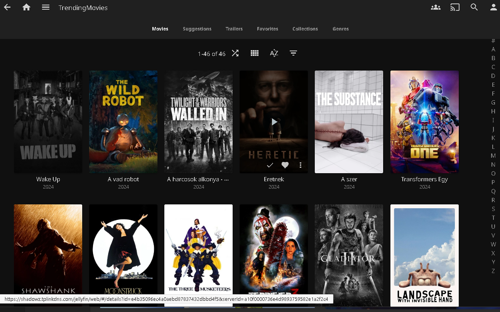

CineFlow is an open-source software application for discovering and watching movies. Mostly inspired by [Overseerr](https://overseerr.dev) and [Jellyseerr](https://docs.jellyseerr.dev) however, it does not provide the same functionality and way of working.

# CineFlow

This project is a media management system that automates the collection of media information from various sources. It supports integration with multiple 3rd party applications implemented as modules, such as Jackett, Jellyfin, TMDb, and qBittorrent currently.

## Current Features

- Show available and trending media in your media server
- Download media directly from your media server
- Support and use the following 3rd parties
  - [TMDb](https://www.themoviedb.org),
  - [Jackett](https://github.com/Jackett/Jackett)
  - [Jellyfin](https://jellyfin.org)
  - [qBittorrent](https://www.qbittorrent.org)

## Prerequisites

- Own Jackett instance with your tracker
- TMDb API, which you can request here: https://www.themoviedb.org/settings/api
- Your own Jellyfin instance
- qBittorrent installation

## How it is working

  - Collect trending media periodically from TMDb
  - Collect the latest items periodically from Jackett
  - Manage a library in your disk with dummy items from the collected media
  - This can be used as a media library in your media server
  - Marked items (favorites) added to your download manager
  - Downloaded and already owned items (based on the media server) removed from the library
  - Library posters can be modified to show extra info like:
    - Items without a download link will be grayscale
    - Can add a colored border if a world is present in the tracker data, like resolution or language




## Getting Started

### Run the application

1.) Create a folder where you want to export items add the 'movie' subfolder in Jellyfin as movie library

2.) Create you config.json based on this example:
  ```json
    {
        "refresh": {
            "movies": true
        },
        "tmdb": {
            "key": "your_tmdb_api_key",
            "lang": "en-US"
        },
        "jackett": {
            "url": "http://192.your.jackett.ip:9117",
            "key": "your_jackett_api_key",
            "include": "1080p",
            "categories": "2040"
        },
        "jellyfin": {
            "url": "http://192.your.jellyfin.ip:8096",
            "key": "your_jellyfin_api_key",
            "user": "jellyfin_username",
            "libraries": "Library_Name_from_point_1,"
        },
        "poster": {
            "rules": ["HDR|hdr|=green"]
        },
        "downloader": {
            "url": "http://191.your.qbittorrent.webui:8080",
            "user": "username",
            "passw": "password",
            "savepath": "/downloads/folder"
        }
    }
  ```

The following parameters optional:
- tmdb.lang (default is en-US)
- jackett.include
- jackett.categories (default is 2000)
- poster.rules

3.) Start the application

- Run as a container
```sh
docker run -d \
--name cineflow \
--restart unless-stopped \
-v your_library_path:/data \
-v location_of/config.json:/data/config.json \
sandorszilagyi/cineflow
```

- Run on Windows (PowerShell) require Python 3.x and Git
```PowerShell
# Get the applicatiom
git clone https://github.com/huszilagyisandor/CineFlow.git
cd CineFlow
pip install -r requirements.txt

# Run
$env:DATA_DIR="location_of_config.json"
$env:LIBRARY_PATH="your_library_path"
python3 main.py
```


## License

This project is licensed under the MIT License.